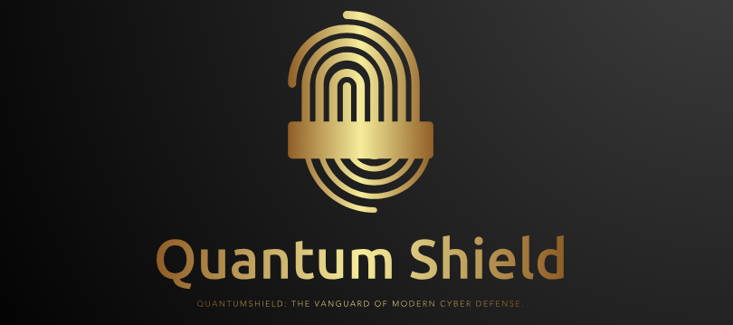

# QuantumShield


  

QuantumShield is a robust cybersecurity application designed to offer advanced protection for your system against a variety of security threats. This project leverages cutting-edge technology to provide real-time traffic analysis, network monitoring, and comprehensive security features.

## 🌟 Features

- **Advanced Traffic Analysis**: Monitor network traffic with detailed insights and alerts.
- **Network Monitoring**: Keep track of network activities and detect unusual patterns.
- **Real-time Alerts**: Receive instant notifications for potential threats.
- **Comprehensive Logging**: Detailed logs for security events and system activities.
- **Customizable**: Easy to configure and extend according to specific security needs.

## 🚀 Getting Started

Follow these steps to set up QuantumShield on your local machine:

### Prerequisites

- **Python**: Version 3.8 or above
- **Virtual Environment**: Recommended for managing dependencies
- **Git**: For version control

### Installation Steps

1. **Clone the Repository**:
    ```bash
    git clone https://github.com/MrShankarAryal/QuantumShield.git
    cd QuantumShield
    ```

2. **Set Up the Virtual Environment**:
    ```bash
    python -m venv venv
    .\venv\Scripts\activate  # On Windows
    source venv/bin/activate  # On Linux/MacOS
    ```

3. **Install Dependencies**:
    ```bash
    pip install -r requirements.txt
    ```

4. **Run the Application**:
    ```bash
    python main.py
    ```

## 🧪 Running Tests

Ensure your application is functioning correctly by running the unit tests:
```bash
pytest tests/
```

## 🤝 Contributing
> "The best way to predict the future is to create it." - Alan Kay

We welcome contributions and feedback from our user community to help shape the future of QuantumShield!


1. **Fork** the repository.
2. **Create a new branch**:
    ```bash
    git checkout -b feature/YourFeature
    ```
3. **Commit your changes**:
    ```bash
    git commit -am 'Add new feature'
    ```
4. **Push to the branch**:
    ```bash
    git push origin feature/YourFeature
    ```
5. **Open a Pull Request** with a description of your changes.

Please refer to the [contributing guidelines](CONTRIBUTING.md) for more details.

## 📜 License

This project is licensed under the [MIT License](LICENSE). See the LICENSE file for details.
# Acknowledgements

## 🛠️ Libraries and Tools

| Library/Tool | Purpose |
|--------------|---------|
| **Scapy** | 📦 Packet manipulation and network traffic analysis |
| **pytest** | 🧪 Unit testing and validation |
| **cryptography** | 🔐 Secure data handling and encryption |

---

# Future Enhancements

🚀 We're constantly working to improve QuantumShield. Here's what's on our roadmap:

1. ### Advanced Threat Detection
   - Integration with cutting-edge AI algorithms
   - Real-time pattern recognition and anomaly detection

2. ### Expanded Monitoring Capabilities
   - Support for additional protocols:
     - IoT-specific protocols
     - Emerging network standards
   - Enhanced service monitoring across diverse environments

3. ### User Interface Overhaul
   - 🎨 Sleek, modern design
   - 📊 Interactive dashboards with real-time visualizations
   - 📱 Responsive layout for seamless mobile access

4. ### Performance Optimization
   - ⚡ Improved processing speed for large-scale networks
   - 🧠 Intelligent resource allocation

5. ### Customization and Flexibility
   - 🔧 User-defined rule sets and alert thresholds
   - 🔌 Extensible plugin architecture for community contributions

---


## 📬 Contact

<div align="center">

| Contact | Information |
|---------|-------------|
| **Developer** | Shankar Aryal |
| **Email** | [shankararyal737@gmail.com](mailto:shankararyal737@gmail.com) |
| **GitHub** | [@MrShankarAryal](https://github.com/MrShankarAryal) |
| **Website** | [mrshankararyal.github.io](https://mrshankararyal.github.io) |

</div>

---

<div align="center">

💖 Thank you for your interest in QuantumShield! 💖

</div>

